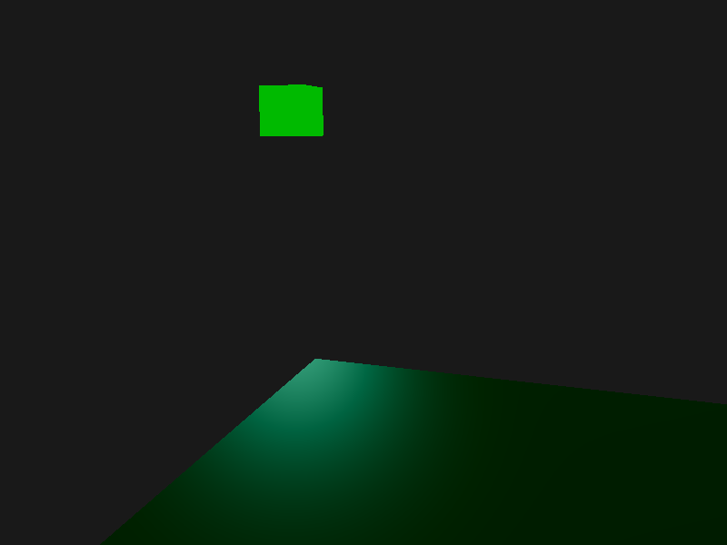
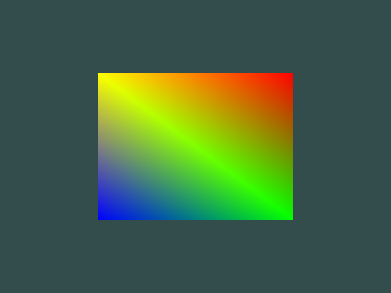

# Learn OpenGL (with Rust!)

My progress through [https://learnopengl.com](https://learnopengl.com) using [Rust](https://www.rust-lang.org/), [GLFW](https://github.com/PistonDevelopers/glfw-rs), and [glow](https://github.com/grovesNL/glow).

Each commit with a prefix `Chapter: page` roughly corresponds to a page on [https://learnopengl.com](https://learnopengl.com).
